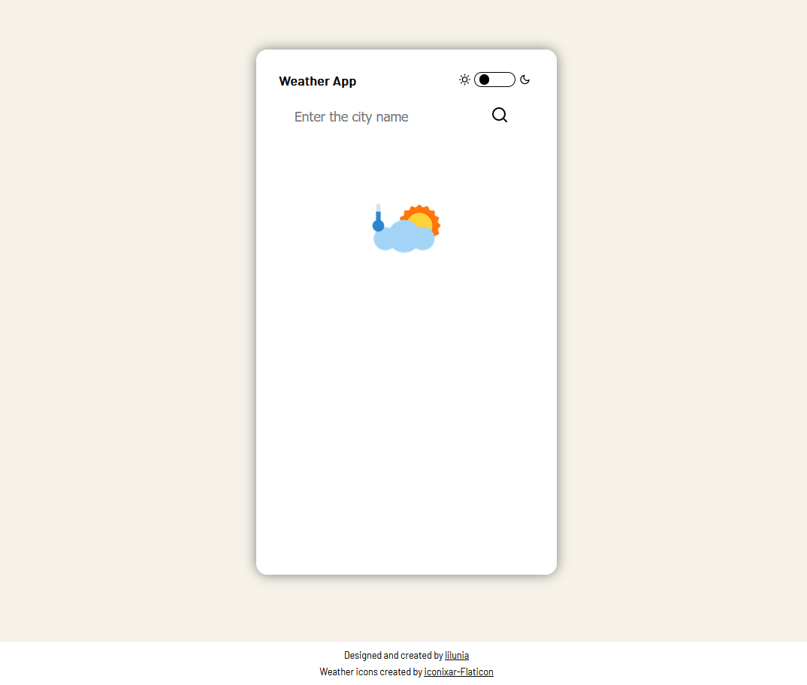
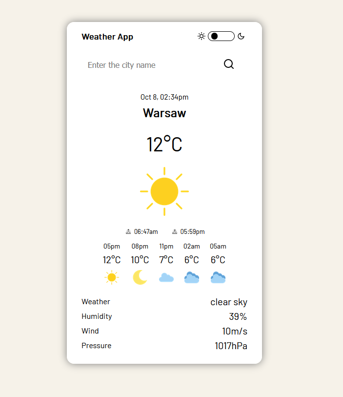
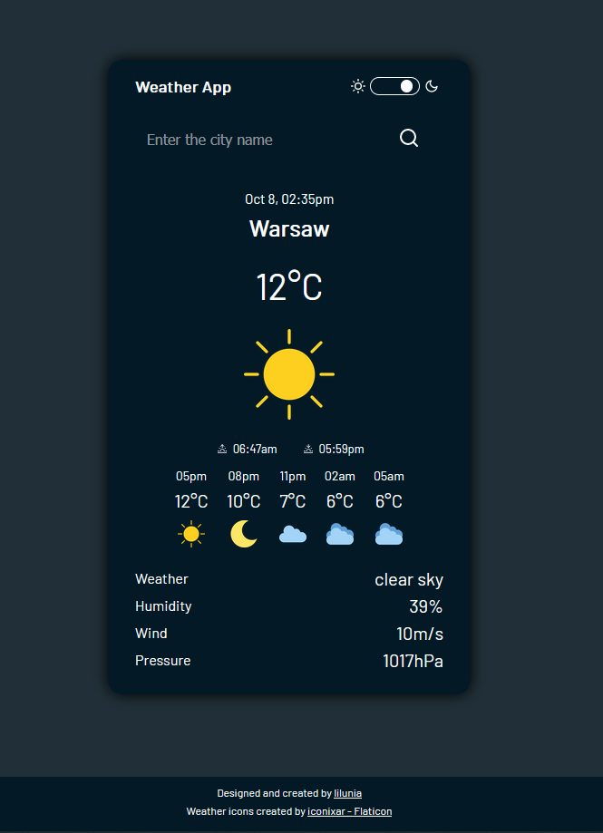

# WeatherApp

## Table of contents

* [General info](#general-info)
* [Technologies](#technologies)
* [Screenshots](#screenshots)
* [JavaScript properties and methods](#javaScript-properties-and-methods)
* [Live](#live)

## General info

A weather application based on <a href="https://openweathermap.org/api">the OpenWeather</a> API.

The application provides information not only about the current weather in a given city in the world, but also the local time and sunrise and sunset times. With this application you can check the current weather in a given city and the 12 hour forecast with 3 hour increments.

This application has two modes (dark and light). You can switch between them and choose the one you prefer.

WeatherApp is written in English language. Own project.

## Technologies

<p align="left">
<a href="https://developer.mozilla.org/en-US/docs/Web/HTML?retiredLocale=pl"></a>
<a href="https://developer.mozilla.org/en-US/docs/Web/CSS?retiredLocale=pl"></a>
<a href="https://sass-lang.com/"></a>
<a href="https://developer.mozilla.org/en-US/docs/Web/JavaScript"></a>

- HTML
- CSS
- SASS & BEM
- Javascript

</p>

## Screenshots

- light mode
     <p align="center">
     
     </p>

- dark mode
     <p align="center">
     
     </p>

## JavaScript properties and methods

### In this project I did cover Web API and the following inbuilt JavaScript properties and methods
- RESTful API
- fetch()
- Object.assign()
- push()
- forEach()
- createElement()
- append()
- Array() constructor
- Date() constructor
- getTimezoneOffset()
- getHours()
- getMinutes()
- getMonth()
- Math.floor()
- Math.abs()
- setAttribute()
- setInterval()
- classList
- add()
- contains()
- toggle()
- setProperty()
- innerHTML
- textContent

## Installation

To run this project, you must have the following dependencies installed:

- Git (https://git-scm.com)

```bash

git clone https://github.com/lilunia/WeatherApp.git

```

## Live

<a href="lilunia.github.io/WeatherApp/">lilunia.github.io/WeatherApp/</a>
