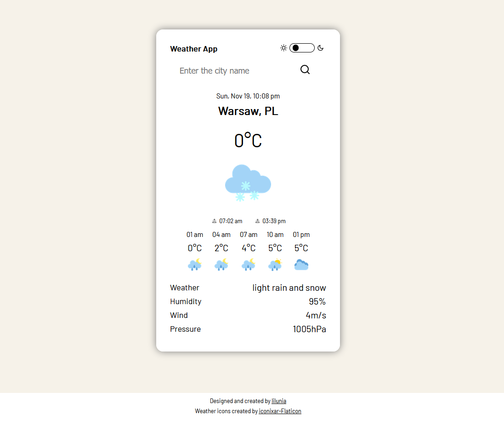
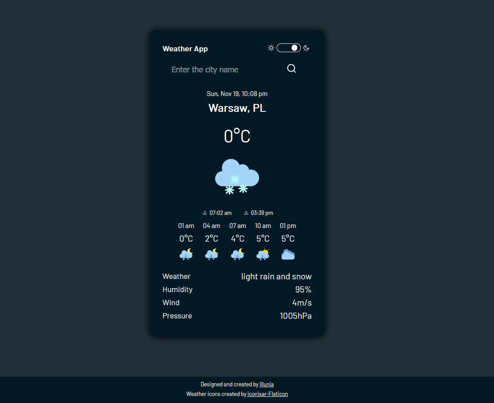

## WeatherApp

A weather application based on API from <a href="https://openweathermap.org/api">OpenWeather</a>.

The application provides information not only about the current weather in a given city in the world but also the local time and sunrise and sunset times. With this application you can check the current weather in a given city and 12 hour forecast with a 3-hour step.

This app has two modes (dark and light). Switch between those two and choose the version you prefer.

WeatherApp was written in english language.

## Tech used

- HTML
- CSS
- SASS & BEM
- Javascript

## Screenshots

- light mode
  

  
  

  

  
  

- dark mode
  

  
  

## In this project I did cover Web API and the following inbuilt JavaScript properties and methods:

- RESTful API
- fetch()
- Object.assign()
- push()
- forEach()
- createElement()
- append()
- Array() constructor
- Date() constructor
- getTimezoneOffset()
- getHours()
- getMinutes()
- getMonth()
- Math.floor()
- Math.abs()
- setAttribute()
- setInterval()
- classList
- add()
- contains()
- toggle()
- setProperty()
- innerHTML
- textContent

## Live

<a href="lilunia.github.io/WeatherApp/">lilunia.github.io/WeatherApp/</a>
